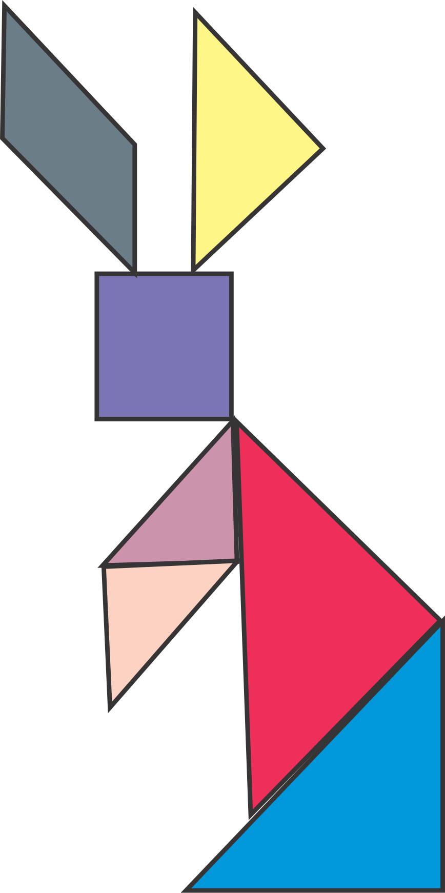

<h1>Tangram Coelho</h1>

Tangram é um antigo jogo chinês, que consiste na formação de figuras e desenhos por meio de 7 peças (5 triângulos, 1 quadrado e 1 paralelogramo).

<strong><i>Fonte: <a  href="http://mundoeducacao.bol.uol.com.br/curiosidades/tangram.htm" ></strong>Mundo Educação</a> </i>

 

<strong>Aluno:</strong> Guilherme Berson

<strong>Professor:</strong> Silvanno Malffati

<strong>Matéria:</strong> Computação Gráfica

<h3>Sobre</h3>

Prova para compor a nota <strong>A1</strong> da matéria de Computação gráfica, onde o objetivo foi com as primitivas (Quadrado, triangulo e retangulo),fazer um desenho de um animal qualquer, para essa avaliação escolhi fazer um Coelho como segue na imagem abaixo.

<h3>Linguagem/Ferramentas</h3>
<ul>
    <li><a href="https://www.java.com/pt_BR/">JAVA</a></li>
    <li><a href="https://developer.android.com/studio/index.html?hl=pt-br">Android Studio</a></li>
</ul>